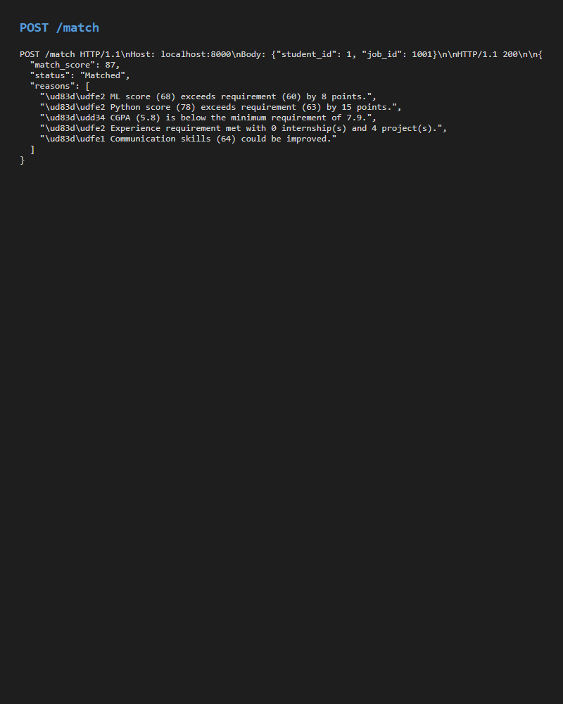
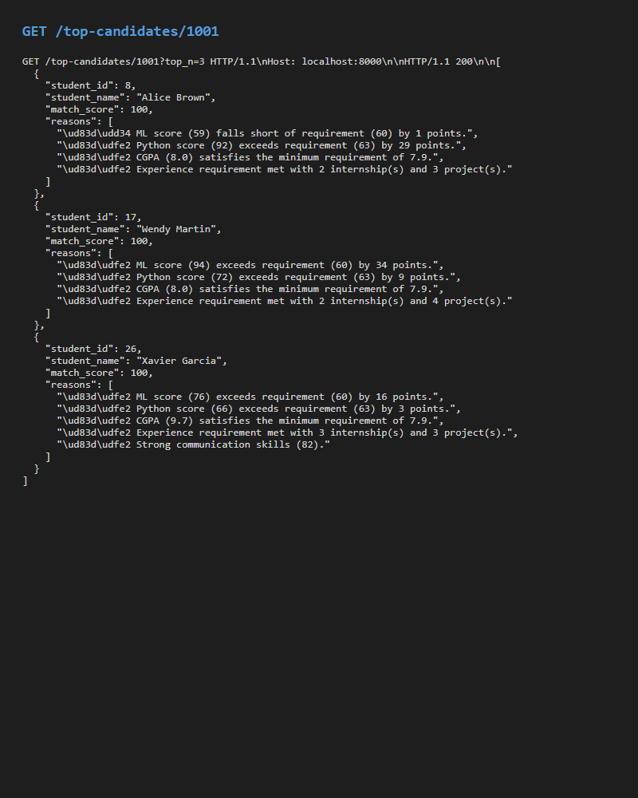

# PlaceMux Student ↔ Job Matching System

This project implements the intelligence layer for PlaceMux, a student-job marketplace. It provides a baseline rule-based matching system that pairs students with jobs based on skill overlap, verified scores, and academic metrics.

## Approach & Methodology

Our core philosophy for building the PlaceMux matching system is **"Baseline First, Explainability Always."** 

Instead of jumping straight into complex, black-box Machine Learning models, we intentionally designed a robust, rule-based baseline foundation. This approach ensures:
1. **Explainability**: Every match score can be broken down into human-readable reasons (e.g., "Python score exceeds requirement"). Both students and recruiters need to understand *why* a match occurred.
2. **Measurability**: By establishing a clear feature space (skills, CGPA, experience) and implementing standard evaluation metrics (Precision, Recall, FPR), we have a concrete benchmark to compare future ML models against.
3. **Integration Readiness**: We built a clear, tested API contract from day one so the backend can immediately start using the intelligence layer without waiting for advanced AI models.

The system evaluates all students against a specific job's requirements, calculates a weighted match percentage (Technical Skills: 50%, CGPA: 20%, Experience: 20%, Soft Skills: 10%), applies penalties for falling short, and ranks the Top-N candidates.

## Features
- **Baseline Matching Engine**: Rule-based scoring with configurable weights for skills, scores, and academic performance.
- **Explainability Layer**: Human-readable reasons explaining why a student was matched with a job and their specific score.
- **Ranking System**: Top-N candidate ranking for a given job.
- **Evaluation Metrics**: Pipeline to measure Precision, Recall, False Positive Rate (FPR), and Accuracy on sample datasets.
- **API**: FastAPI endpoints to access matching and ranking results.

## Feature Space

### Student Features
| Feature | Type | Description |
|---|---|---|
| Student ID | Integer | Unique identifier for the student |
| Name | String | Full name of the student |
| Verified Python/SQL/ML Score | Integer | Skill scores between 0-100 verified by tests |
| Communication/Aptitude Score | Integer | Soft skill and aptitude scores (0-100) |
| Project/Internship Count | Integer | Number of projects built and internships completed |
| CGPA | Float | Academic performance (0.0 - 10.0) |

### Job Features
| Feature | Type | Description |
|---|---|---|
| Job ID | Integer | Unique identifier for the job |
| Company Name | String | Name of the hiring company |
| Role | String | Job title (e.g., Data Scientist) |
| Required Skills | String/List | Comma-separated list of required technical skills |
| Minimum Skill Scores | String/List | Comma-separated list of minimum passing scores for skills |
| Minimum CGPA | Float | Minimum acceptable CGPA |
| Experience Requirement | Integer | Required years of experience (or equivalent projects/internships) |

## Setup
1. Create a virtual environment (optional but recommended)
2. Install dependencies:
   ```bash
   pip install -r requirements.txt
   ```
3. Run the API:
   ```bash
   uvicorn src.api:app --reload
   ```

## Structure
- `data/`: Sample datasets for students and jobs.
- `notebooks/`: Interactive walkthrough and exploration.
- `src/`: Core logic for feature engineering, matching, metrics, and API.
- `tests/`: Automated tests.

## Evaluation Results
The initial evaluation logic contained a job-ID mismatch bug that resulted in an all-zero ground truth. This has since been fixed. Using an independent, rule-based ground truth definition, the baseline matcher achieves the following performance on the sample dataset:
- **Precision:** 17.8%
- **Recall:** 100.0%
- **False Positive Rate (FPR):** 72.7%
- **Accuracy:** 37.2%

## API Demo
Below are examples of the API in action:

**Single Match Evaluation (`POST /match`)**


**Top-N Ranking (`GET /top-candidates/{job_id}`)**

