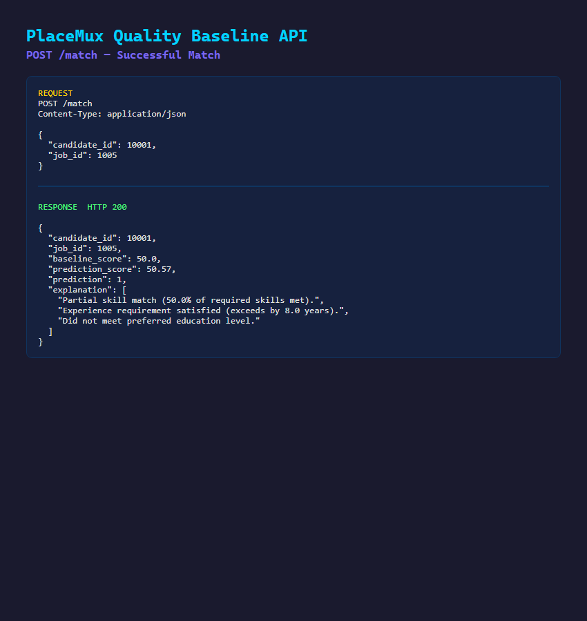
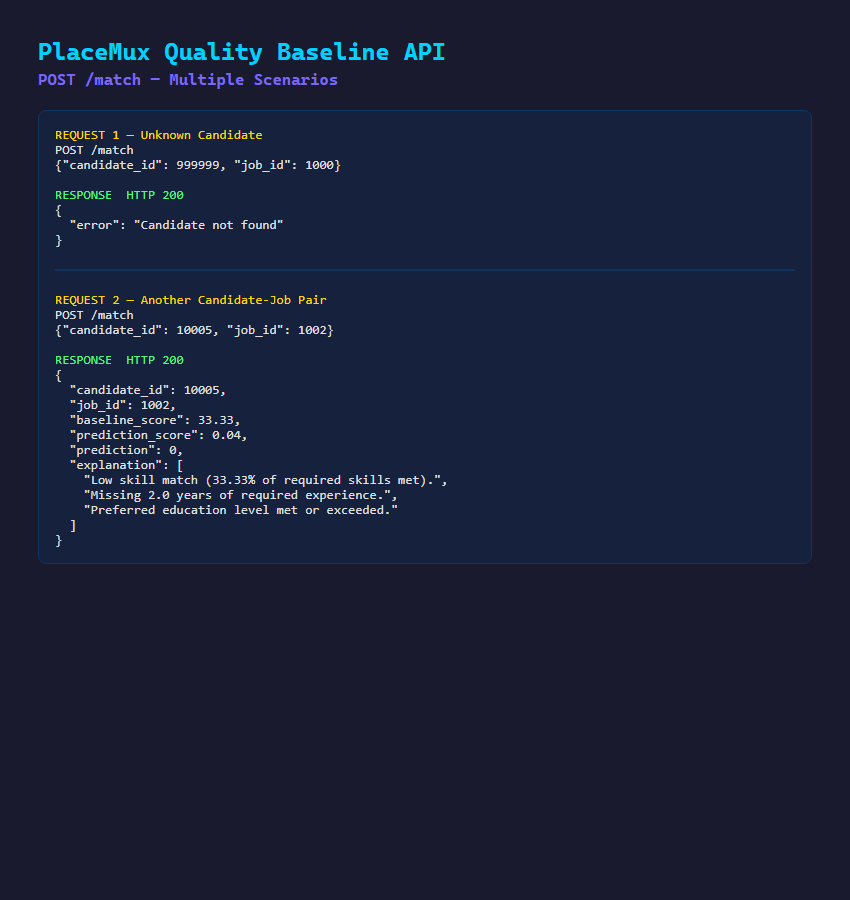

# PlaceMux Quality Baseline Job Matching System

This project implements the "Quality Baseline" Job Matching System for PlaceMux. It establishes a transparent, explainable benchmark that all future Machine Learning models must outperform before being deployed to production. This is a quality and measurement baseline prioritizing reproducibility and explainability over model sophistication.

## Upstream & Downstream Context
- **Upstream Dependency (Week-2 Matching):** This project treats `data/candidate_profiles.csv` and `data/jobs.csv` as if they were handed off by the Week-2 matching task. These datasets represent verified skill scores already produced upstream, not data invented in isolation.
- **Downstream Handoff (Week-3 Monitoring):** The outputs of this project—the baseline model (`models/baseline_model.pkl`), the evaluation metrics (`metrics/metrics.json`), and the experiment log (`metrics/experiment_log.csv`)—are handed off to the Week-3 Monitoring team to watch for quality drift over time. See `docs/handoff_notes.md` for details.

## Project Structure
- `data/`: Realistically scaled sample datasets for candidates and jobs.
- `notebooks/`: An interactive Jupyter notebook demonstrating the end-to-end pipeline.
- `src/`: The core pipeline including data loading, explainable feature engineering, the baseline matching algorithm, logistic regression training, evaluation, explainability layer, and FastAPI service.
- `models/`: Contains the serialized scikit-learn `LogisticRegression` model.
- `metrics/`: Contains `metrics.json` and the continuous `experiment_log.csv` for experiment tracking.
- `tests/`: Pytest suite covering explicit edge cases for matching and the API.
- `docs/`: Architecture diagrams, demo guides, and handoff notes.
- `Outputs/`: Auto-generated screenshots of the live API demo.

## Setup & Execution
1. Install dependencies: `pip install -r requirements.txt`
2. Generate data: `python src/data_loader.py`
3. Train model: `python src/train.py`
4. Evaluate: `python src/evaluate.py`
5. Run tests: `pytest tests/`
6. Start API: `uvicorn src.api:app --reload`

## Baseline Verification
**Show me one candidate, one job, the match score, the prediction, the explanation, and the precision/recall numbers:**
Candidate "Hank 0" (ID: 10000) has skills [Docker, C#, PowerBI, Data Analysis, AWS, Kubernetes], 10 years of experience, and a Master's degree. Job "Data Scientist" (ID: 1000) requires [React, PowerBI], 2 years of experience, and prefers a Master's. The rule-based **Baseline Score** is 50.0% because 1 out of 2 required skills (PowerBI) matched. The LogisticRegression model evaluated this pair and gave a **Prediction** of `0` (No Match) with a confidence of 16.89%. The dynamically generated **Explanation** reads: "Partial skill match (50.0% of required skills met)", "Experience requirement satisfied (exceeds by 8.0 years)", and "Preferred education level met or exceeded". When evaluated on the held-out test set, the model achieved a **Precision** of 83.65%, **Recall** of 69.71%, **Accuracy** of 95.99%, and a **False Positive Rate** of 1.37%.

## API Demo
Below are examples of the API in action:

**Single Match Evaluation (`POST /match`)**

**Edge Cases (`POST /match`)**

