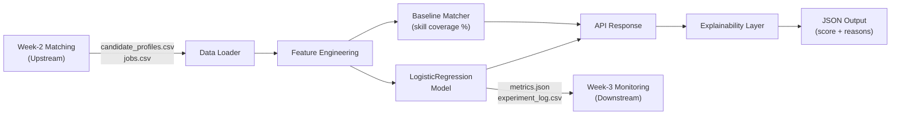

# Architecture: PlaceMux Quality Baseline Pipeline

## Pipeline Flow

## Component Details

### 1. Data Loader (`src/data_loader.py`)
- **Input:** `data/candidate_profiles.csv`, `data/jobs.csv`
- **Output:** Pandas DataFrames for candidates and jobs
- **Upstream dependency:** These CSV files represent verified skill scores produced by the Week-2 Matching deliverable. They are treated as a handoff artifact, not data invented in isolation.

### 2. Feature Engineering (`src/feature_engineering.py`)
- **Input:** Candidate and job DataFrames
- **Output:** Pairwise feature table with columns: `candidate_id`, `job_id`, `skill_overlap_percentage`, `experience_gap`, `education_match`, `certification_match_count`, `required_skill_coverage`, `label`
- **Design:** Every feature is traceable to a plain-English reason. No embeddings or opaque signals.

### 3. Baseline Matcher (`src/baseline_matcher.py`)
- **Formula:** `match_score = (required_skills_matched / total_required_skills) × 100`
- **Purpose:** This score is logged before any ML is introduced. Every future model must beat this baseline.

### 4. Model Training (`src/train.py`)
- **Model:** scikit-learn `LogisticRegression` (explicitly no deep learning, LLMs, or black-box models)
- **Split:** 70% train / 15% validation / 15% test
- **Output:** `models/baseline_model.pkl`

### 5. Evaluation (`src/evaluate.py`)
- **Evaluated strictly on the held-out 15% test split**
- **Metrics:** Precision, Recall, Accuracy, F1, False Positive Rate
- **Output:** `metrics/metrics.json`, appends to `metrics/experiment_log.csv`

### 6. Explainability (`src/explainability.py`)
- Dynamically generates plain-English explanations from actual feature values
- Never hardcoded per-pair text

### 7. API (`src/api.py`)
- **POST /match** → returns `baseline_score`, `prediction_score`, `prediction`, `explanation`
- Handles all edge cases with structured error JSON

## Upstream / Downstream Dependencies

| Direction | Team | Handoff Point | What's Exchanged |
|-----------|------|--------------|-----------------|
| **Upstream** | Week-2 Matching | `data/*.csv` | Verified candidate skill scores and job requirements |
| **Downstream** | Week-3 Monitoring | `models/baseline_model.pkl`, `metrics/metrics.json`, `metrics/experiment_log.csv` | Trained model, baseline metrics, experiment history |
