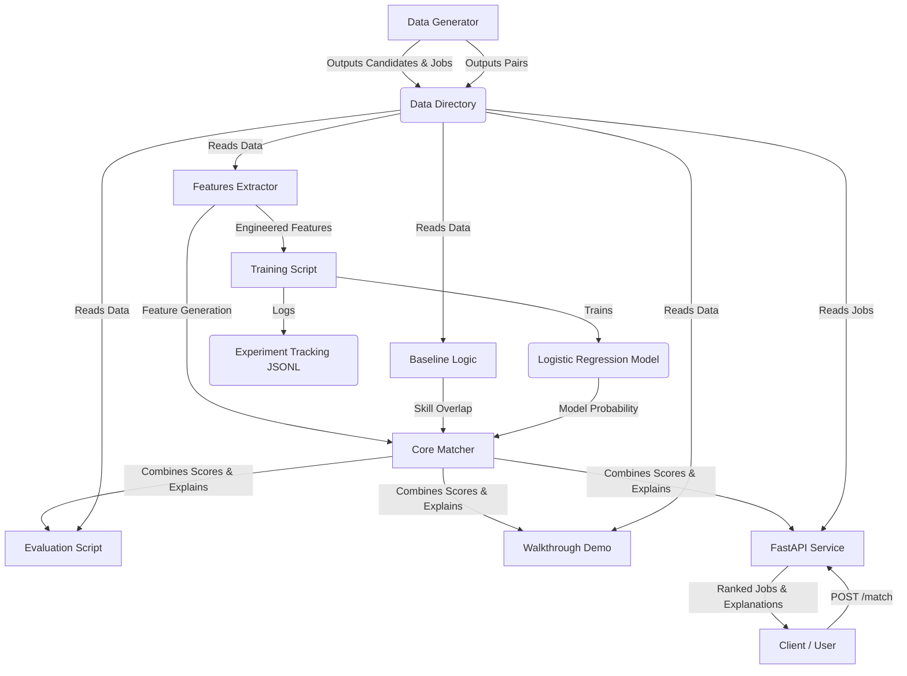

# System Architecture

## Flow Description
1. **Data Generation**: `data_generator.py` generates the synthetic mock tables for training and testing.
2. **Feature Engineering**: `features.py` centralizes feature extraction logically matching skills, education, experience, and project counts.
3. **Training**: `train.py` takes engineered features, trains Logistic Regression and produces the `.joblib` model object.
4. **Matcher Core**: `matcher.py` combines the rules-based baseline score with ML probabilities and constructs an explainable payload.
5. **Services & Endpoints**: Both the offline testing scripts and the live API endpoint consume the Matcher Core logic.
